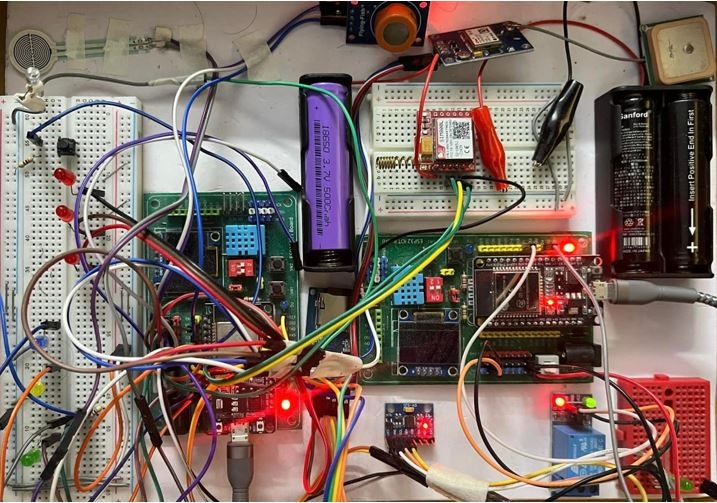

# Smart-Helmet_IoT

## Table of Contents
- [Introduction](#introduction)
- [Features](#features)
- [Technologies Used](#technologies-used)
- [How It Works](#how-it-works)
- [Screenshot](#screenshot)

## Introduction
An IoT-integrated smart helmet equipped with innovative and unique safety features. This project proposes a smart helmet system that identifies hazardous situations and enhances rider safety by integrating various sensors and communication technologies.

## Features
- **Helmet Detection:** Ensures the rider is wearing the helmet before ignition starts.
- **Alcohol Monitoring:** Detects if the rider has consumed alcohol and disables ignition if so.
- **Fall Detection:** Detects accidents or falls and automatically turns off the bike ignition.
- **Road Condition Alerts:** Provides notifications about road humps, accident-prone areas, and poor road quality.
- **Emergency SMS Alerts:** Sends GPS location alerts in case of accidents or alcohol detection.
- **ESP-NOW Communication:** Enables real-time communication between helmet and bike unit for safety control.
- **GPS & Grid-Cluster Technique:** Optimizes road condition alert performance.

## Technologies Used
- **ESP32 Microcontroller** for sensor integration and communication
- **Arduino IDE** for firmware development
- **ESP-NOW Protocol** for wireless communication between helmet and bike
- **GPS & GSM Module** for location tracking and sms alert
- **Sensors:** Alcohol sensor, accelerometer (fall detection), helmet detection sensor

## How It Works
The helmet unit continuously monitors safety parameters. If the rider is not wearing the helmet, has consumed alcohol, or if a fall is detected, the system automatically disables the bike’s ignition. Simultaneously, it monitors road conditions and sends timely alerts to the rider. Emergency SMS notifications are sent with precise GPS location data to pre-designated contacts during hazardous events.

## Screenshot
- **System Prototype:**  
 
